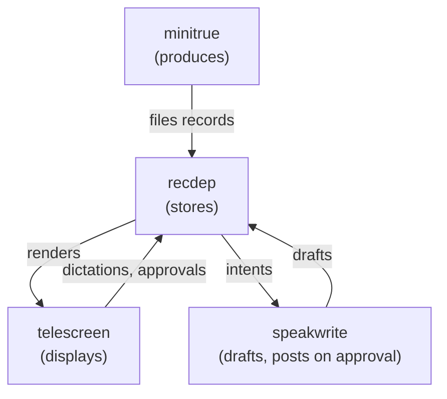

<p align="center">
  <a href="https://github.com/maxgio92/telescreen/actions/workflows/ci.yml"></a>
  <a href="https://github.com/maxgio92/telescreen/releases/latest"></a>
</p>

<p align="center"></p>

telescreen is a terminal dashboard for your work notifications: a
producer agent polls Slack, GitHub, and Linear and files each event as
a plain file; you triage in a TUI; a drafting agent writes replies you
dictate; nothing posts without your double-key approval.

One binary.<br>
Files are the only interface.<br>
Agents draft, only you publish.

[Install](#install) ·
[Documentation](docs/README.md) ·
[Getting started](docs/getting-started/install.md) ·
[Design](docs/design/speakwrite.md)

<p align="center"></p>

Your notifications live in three inboxes that all want you now: a Slack
thread here, a review request there, a Linear ticket assigned while you
were reading the other two. You switch contexts, lose the thread, and
answer the loudest one instead of the oldest one. What you want is one
local queue you can audit with `cat`, and agent drafts that never post
a word on their own. That is this.

## Try it

The dashboard alone, no agents, no timers, nothing enrolled:

```
go install github.com/maxgio92/telescreen@latest
telescreen demo
```

That is the screen with one record in the tube: move it with `t`, `u`,
`f`, read it in the detail pane, feed it to the memory hole. The real
feed and the drafting need the agents enrolled (the Install section
below); they run on systemd user units and require the claude CLI.

## Install

<p>
  
  
  
  
  
</p>

One binary carries the screen, the agents, the actor, and the
installer. Pick your method; adjust version and arch in the package
URLs (`amd64` or `arm64`).

Homebrew (macOS and Linux):

```
brew install maxgio92/tap/telescreen
```

Go:

```
go install github.com/maxgio92/telescreen@latest
```

Fedora and RHEL (dnf installs straight from a URL):

```
dnf install https://github.com/maxgio92/telescreen/releases/latest/download/telescreen_0.1.1_linux_amd64.rpm
```

Debian and Ubuntu (apt needs the file on disk first):

```
curl -sLO https://github.com/maxgio92/telescreen/releases/latest/download/telescreen_0.1.1_linux_amd64.deb
apt install ./telescreen_0.1.1_linux_amd64.deb
```

Alpine (the package is unsigned, so apk needs the flag):

```
wget -q https://github.com/maxgio92/telescreen/releases/latest/download/telescreen_0.1.1_linux_amd64.apk
apk add --allow-untrusted ./telescreen_0.1.1_linux_amd64.apk
```

Plain tar.gz archives sit on the
[latest release](https://github.com/maxgio92/telescreen/releases/latest).
Later, `telescreen update` swaps the installed binary for the newest
release in place.

Then enroll the whole stack, or one component at a time:

```
telescreen install                 # minitrue, speakwrite, thinkpol
telescreen install thinkpol        # one component
telescreen install --dry-run       # print the plan without writing
telescreen install --force         # restore the shipped skills over your edits
```

The installer carries everything it enrolls: it writes the agent
skills to `~/.claude/skills/`, the systemd user units to
`~/.config/systemd/user/` (ExecStart points at the installing binary),
creates the state dirs, and enables the units. Identity lives in
`~/.config/minitrue.env` (SLACK_USER_ID, GH_LOGIN, LINEAR_ASSIGNEE,
REPO). From source, for development or by choice, `make install`
builds the binary into `~/.local/bin` and runs its installer.

## Documentation

| You need | Read |
|---|---|
| the index, with reading paths | [docs/README.md](docs/README.md) |
| to install and see the screen | [getting-started/install.md](docs/getting-started/install.md) |
| to enroll the agents | [getting-started/enroll.md](docs/getting-started/enroll.md) |
| a first record, end to end | [getting-started/first-record.md](docs/getting-started/first-record.md) |
| every knob you can turn | [guides/configuration.md](docs/guides/configuration.md) |
| to write your own producer | [guides/write-a-producer.md](docs/guides/write-a-producer.md) |
| to swap the posting actor | [guides/swap-the-actor.md](docs/guides/swap-the-actor.md) |
| something is broken | [guides/troubleshooting.md](docs/guides/troubleshooting.md) |
| the queue contract, normative | [contracts/recdep.md](docs/contracts/recdep.md) |
| the actor contract, normative | [contracts/thinkpol.md](docs/contracts/thinkpol.md) |
| why the drafting layer looks like this | [design/speakwrite.md](docs/design/speakwrite.md) |
| the 1984 naming lore | [design/names.md](docs/design/names.md) |
| the full CLI reference | [reference/telescreen.md](docs/reference/telescreen.md) |

## How it works

Four components, one direction of flow:



Files are the only interface between them. No sockets, no database, no
shared process: the queue is a directory of markdown files, and each
component reads or writes exactly its own part of it.

The life of one record:

1. An event lands in `tube/` as a file: the producer polled Slack,
   GitHub, or Linear and filed it.
2. You take it to `desk/`: seen, the next move is yours.
3. You dictate a stance with `s`: your editor opens on an intent,
   you write what you think in plain words.
4. The clerk drafts the response into the record; the row turns
   `[draft]`.
5. You approve with `p` `p`: the double keypress is the recorded
   consent.
6. The actor posts the draft upstream, stamps the record with the
   comment URL, and files it to `upsub/`.

The drawers, one directory per state:

| Drawer | In the cubicle | In plain terms |
|---|---|---|
| `tube/` | the pneumatic tube delivers a record | landed, unseen |
| `desk/` | the record sits on your desk | seen, the next move is yours |
| `upsub/` | submitted to higher authority | you acted, the other side owes the next move |
| `files/` | filed away | closed |

## The names

Every component is named in Newspeak, after Orwell's 1984: the world
where the machinery watches the human. Here the direction flips and
the human runs the ministry.

| Name | Role |
|---|---|
| minitrue | the producer: polls the sources, files the records |
| recdep | the file store: one directory per state |
| telescreen | the screen: this TUI |
| speakwrite | the drafting agent: you dictate, it writes |
| thinkpol | the actor: posts approved drafts, nothing else |
| memoryhole | permanent delete: nothing returns |
| tube, desk, upsub, files | the drawers |

The full lore, with why each name is a precise metaphor, lives in
[docs/design/names.md](docs/design/names.md).

## Usage

```
telescreen          # the screen
telescreen --once   # print per-drawer counts and exit
telescreen export --output json   # every record in the four drawers as one JSON document
telescreen verify   # lint the queue against the docs/contracts/recdep.md grammar; exit 1 on findings
```

The full CLI reference, including the install, minitrue, speakwrite,
thinkpol, and version subcommands, lives at
[docs/reference/telescreen.md](docs/reference/telescreen.md).

### Keys

| Key | Effect |
|---|---|
| `tab`/`shift+tab`, `1`-`5` | switch view (tube, desk, upsub, files, memoryhole) |
| `j`/`k`, arrows, wheel | navigate; click selects a row or a tab |
| `o`, `enter` | open the record's URL |
| `y` | copy the URL (wl-copy, fallback xclip) |
| `t` | take (tube to desk) |
| `u` | up (tube or desk to upsub: you answered, their move) |
| `f` | file it (any open drawer to files) |
| `b` | back, one drawer |
| `s` | dictate into the speakwrite (tube, desk, upsub) |
| `p` `p` | approve publishing a draft (records with a matching publisher: GitHub PRs, Slack threads, Linear issues) |
| `D` | discard a draft |
| `x` `x` | the memory hole (files only; the screen barks first) |
| `q` | switch off the telescreen, a luxury Smith never had |

The detail pane shows the selected record in full: the content line,
the preview, then the labeled path (one `cat` away, or one agent
handle), url, and seen lines.

Under no circumstances does this screen watch you back. That would be
doubleplusungood.
