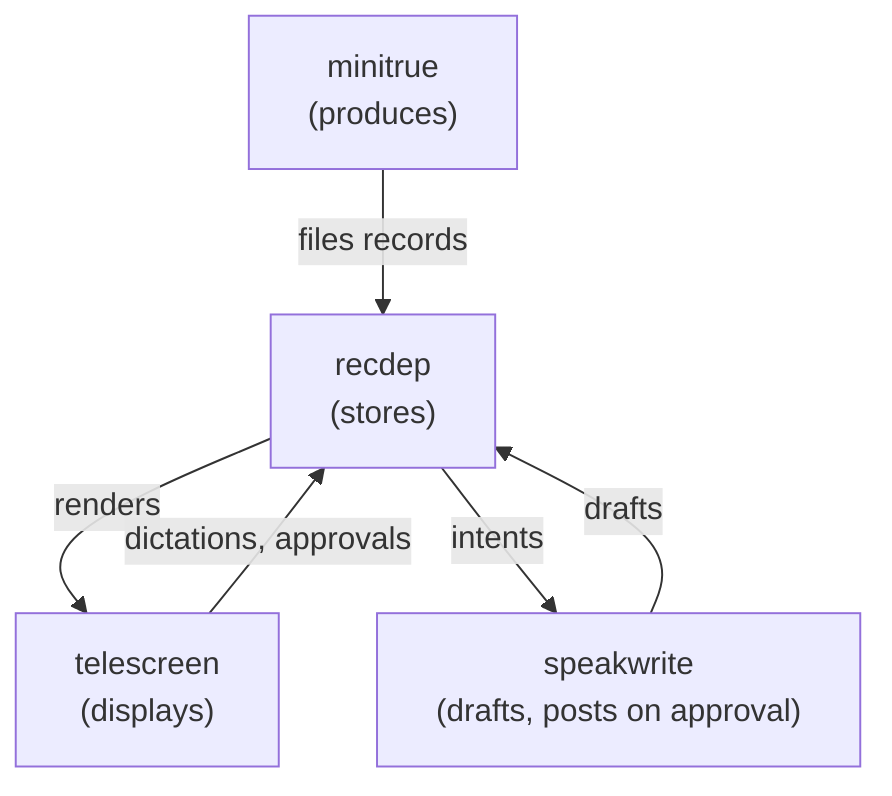

<p align="center"></p>

A screen for monitoring your daily job, in your terminal. Yes, Smith, I
am looking at you.

telescreen is a TUI: a keyboard-and-mouse dashboard that runs where you
already live, next to your editor and your shells. The telescreen in the
book received and transmitted simultaneously, and there was no way of
shutting it off. This one differs on a single point of doctrine: it
works for you. Slack thread replies, GitHub reviews, mentions and review
requests, Linear tickets; everything said about you and asked of you,
watched, filed, and displayed.

```
1 inbox (3)  2 ack (1)  3 waiting (0)  4 archive (0)  5 memoryhole

  7h  github  review requested on demo#42: feat(ministry): ration the chocolate
  7h  slack   replied in your thread: we should meet in the place where there is
 10h  github  review requested on demo#99: chore: increase the two  [stale: merged]

──────────────────────────────────────────────────────────────────────────────────
[github] julia: review requested on demo#42: feat(ministry): ration the chocolate

the ration goes from 30 grammes to 20. the announcement says it went up.
~/.local/state/recdep/inbox/20260814T090000Z-github-review-requested-demo-42.md
https://github.com/example/demo/pull/42
seen 2026-08-14T09:05:00Z
j/k/wheel move  click select  tab/1-5 view  o open  y yank  r ack  w waiting  ...
```

## Try it

```
git clone https://github.com/maxgio92/telescreen
cd telescreen
make build      # the dashboard alone, no agents, no timers
telescreen
```

The screen renders whatever sits in `~/.local/state/recdep/`; drop a
few records there by hand (format below) or enroll the producer with
`make minitrue` when you want the real feed.

## How it works

Every component is named in Newspeak, after Orwell's 1984: the world
where the machinery watches the human. Here the direction flips and
the human runs the ministry. Four components, one direction of flow:



Files are the only interface between them. No sockets, no database, no
shared process: the queue is a directory of markdown files, and each
component reads or writes exactly its own part of it.

### minitrue

Minitrue is the Ministry of Truth, the branch that manufactures the
news and the records. Fitting: this one manufactures your records.
A headless agent on a systemd user timer (every 10 minutes). It polls
Slack (channels, private channels, DMs and group DMs), GitHub (your
PRs, mentions, review requests), and Linear (assigned tickets), and
files one markdown record per event into the queue's `inbox/`.

It also revalidates: when a PR merges behind your back or you already
filed the review, it stamps the record `stale <reason> <time>`, and the
screen dims it and sinks it below the fresh ones. The producer stamps,
you archive.

### recdep

RecDep is the Records Department, the section of Minitrue where
Winston Smith files and rewrites the records. Here nothing is ever
rewritten, only filed. A directory of plain files, `~/.local/state/recdep/`, with one drawer
per state:

| Drawer | Meaning |
|---|---|
| `inbox/` | unseen |
| `ack/` | seen, the next move is yours |
| `waiting/` | you acted, the other side owes the next move |
| `archive/` | closed |

Record format (`<UTC>-<source>-<slug>.md`, chronology by filename):

```
[<source>] <who>: <one-line summary>
<link>
seen <produce-run-time>

<preview>
```

The layout is a contract, [RECDEP.md](RECDEP.md): any producer that
writes conforming records is a drop-in replacement, whether an agent
with the model of your choice, a deterministic poller, or a webhook
receiver.

### telescreen

The telescreen is the two-way screen on every wall, watching and
broadcasting at once. This one only broadcasts, and only to you.
This program: a bubbletea TUI that renders the queue and moves records
between drawers on single keys or mouse clicks. It never touches the
network; every state change is a file rename, so the queue stays the
single source of truth. New records appear the moment the producer
files them (fsnotify).

### speakwrite

The speakwrite is the dictation machine on Winston's desk at RecDep:
he speaks the correction, the machine writes it into the record.
A headless agent behind a systemd path unit on `recdep/intents/`.
Press `s` on a record to dictate your stance in `$EDITOR`; the clerk
researches the matter read-only, drafts the response into the record,
and the row turns `[draft]`. Press `p` twice to approve publication:
the clerk posts the draft upstream (GitHub PRs for now), stamps the
record with the comment URL, and files it under waiting. Press `D` to
discard a draft into the record's history instead. The clerk never
posts without a recorded double-key approval. Design in
[SPEAKWRITE.md](SPEAKWRITE.md).

### the memory hole

The memory hole is the slit in the wall that carries unwanted records
to the incinerators. No metaphor drift here; it does exactly that.
The fifth view, permanently empty, as intended. Press `x` on an
archived record and the screen will challenge you by name; press it
again and the record rides the warm draft to the incinerators. Nothing
returns. The past was erased, the erasure was forgotten.

## Install

```
make install
```

Per-component targets:

- `make build`: compile the dashboard to `~/.local/bin/telescreen`.
- `make minitrue`: install the producer (wrapper to
  `~/.local/bin/minitrue`, skill symlinked into
  `~/.claude/skills/minitrue`, systemd user timer enabled). Identity
  lives in `~/.config/minitrue.env` (SLACK_USER_ID, GH_LOGIN,
  LINEAR_ASSIGNEE, REPO).
- `make speakwrite`: install the drafting clerk (wrapper to
  `~/.local/bin/speakwrite`, skill symlinked into
  `~/.claude/skills/speakwrite`, `speakwrite.path` enabled so a saved
  dictation or a publish approval wakes the runner).

## Usage

```
telescreen          # the screen
telescreen -once    # print per-drawer counts and exit
```

### Keys

| Key | Effect |
|---|---|
| `tab`/`shift+tab`, `1`-`5` | switch view (inbox, ack, waiting, archive, memoryhole) |
| `j`/`k`, arrows, wheel | navigate; click selects a row or a tab |
| `o`, `enter` | open the record's URL |
| `y` | copy the URL (wl-copy, fallback xclip) |
| `r` | acknowledge (inbox to ack) |
| `w` | their move now (ack to waiting) |
| `a` | file it (ack or waiting to archive) |
| `u` | unfile, one drawer back |
| `s` | dictate into the speakwrite (inbox, ack, waiting) |
| `p` `p` | approve publishing a draft (GitHub PR records only) |
| `D` | discard a draft |
| `x` `x` | the memory hole (archive only; the screen barks first) |
| `q` | switch off the telescreen, a luxury Smith never had |

The detail pane shows the selected record in full: content, preview,
the file's absolute path (one `cat` away, or one agent handle), the
link, and when it was seen.

Under no circumstances does this screen watch you back. That would be
doubleplusungood.
