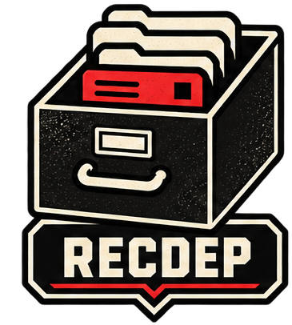

# The names

Every component is named in Newspeak, after Orwell's 1984: the world
where the machinery watches the human. Here the direction flips and the
human runs the ministry. The names are not decoration; each one is a
precise metaphor for what the component does, chosen so the metaphor
never drifts from the mechanism. This page is the lore. The mechanisms
live in the [contracts](../contracts/recdep.md) and the
[README](../../README.md).

## minitrue

Minitrue is the Ministry of Truth, the branch that manufactures the
news and the records. Fitting: this one manufactures your records.
A headless agent on a systemd user timer (every 10 minutes). It polls
Slack (channels, private channels, DMs and group DMs), GitHub (your
PRs, mentions, review requests), and Linear (assigned tickets), and
files one markdown record per event into the queue's `tube/`.

It also revalidates: when a PR merges behind your back or you already
filed the review, it stamps the record `stale <reason> <time>`, and the
screen dims it and sinks it below the fresh ones. The producer stamps,
you file.

The demo record honors the ministry's finest work: the chocolate
ration goes from 30 grammes to 20, and the announcement says it went
up.

## recdep

RecDep is the Records Department, the section of Minitrue where
Winston Smith files and rewrites the records. Here nothing is ever
rewritten, only filed. A directory of plain files,
`~/.local/state/recdep/`, with one drawer per state.

Three drawers are the cubicle's plain furniture: the pneumatic tube
that delivers a record, the desk it sits on while the next move is
yours, the files it retires to. `upsub` is genuine Newspeak from the
book's work orders, "upsub antefiling": submit to higher authority
before filing. That is exactly the drawer's meaning: you acted, the
matter went up, the other side owes the next move.

The layout is a contract, [recdep.md](../contracts/recdep.md): any
producer that writes conforming records is a drop-in replacement,
whether an agent with the model of your choice, a deterministic poller,
or a webhook receiver.

## telescreen

The telescreen is the two-way screen on every wall, watching and
broadcasting at once. This one only broadcasts, and only to you. The
telescreen in the book received and transmitted simultaneously, and
there was no way of shutting it off. This one differs on a single point
of doctrine: it works for you, and `q` switches it off, a luxury Smith
never had.

The program: a bubbletea TUI that renders the queue and moves records
between drawers on single keys or mouse clicks. It never touches the
network; every state change is a file rename, so the queue stays the
single source of truth. New records appear the moment the producer
files them (fsnotify).

## speakwrite

The speakwrite is the dictation machine on Winston's desk at RecDep:
he speaks the correction, the machine writes it into the record.
A headless agent behind a systemd path unit on `recdep/intents/`.
Press `s` on a record to dictate your stance in `$EDITOR`; the clerk
researches the matter read-only, drafts the response into the record,
and the row turns `[draft]`. Press `p` twice to approve publication:
the actor posts the draft upstream, stamps the record with the comment
URL, and moves it to upsub. Press `D` to discard a draft into the
record's history instead. Nothing posts without a recorded double-key
approval. Design in [speakwrite.md](speakwrite.md).

## thinkpol

The Thought Police do not deliberate; they enforce decisions already
taken. That is the whole job description: the actor composes nothing,
judges nothing, and executes exactly the approvals the human already
recorded. The one component with outward reach is the one with zero
judgment, ordinary Go, unit-tested line by line. Contract in
[thinkpol.md](../contracts/thinkpol.md).

## memoryhole

The memory hole is the slit in the wall that carries unwanted records
to the incinerators. No metaphor drift here; it does exactly that.
The fifth view, permanently empty, as intended. Press `x` on a filed
record and the screen will challenge you by name; press it again and
the record rides the warm draft to the incinerators. Nothing returns.
The past was erased, the erasure was forgotten.
