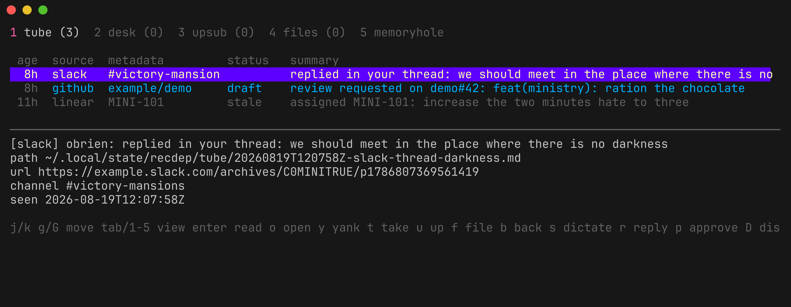
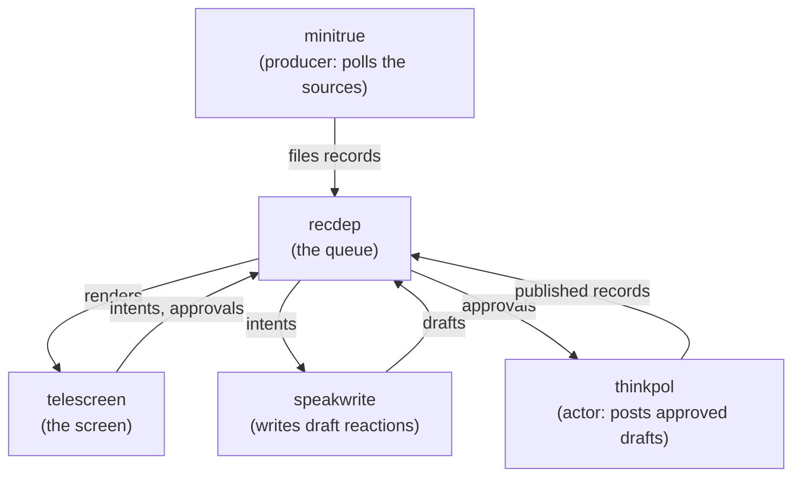

# telescreen


telescreen is a terminal dashboard for your work notifications: a
producer polls Slack, GitHub, and Linear and files each event as a
record, one plain file; you triage in a TUI; an agent writes a draft
reaction for each stance you dictate; nothing posts without your
double-key approval.

One binary.<br>
Files are the only interface.<br>
Agents draft, only you approve.



## Demo

Thirty seconds of triage on fictional records: navigate, read, search,
take, reply, approve-track, and file.

<div id="demo-player" data-cast="assets/demo.cast"></div>

## How it works

Five components, files as every edge:



The life of one record: an event lands in the queue as a file; you
take it to your desk on the screen; you dictate a stance; speakwrite
writes the draft reaction into the record; you approve with a double
keypress; thinkpol posts it and files the record. Every hand-off is a
plain file you can read with cat, and the one component that can post
only acts on a recorded approval.

## Install

Homebrew (macOS and Linux):

```
brew install maxgio92/tap/telescreen
```

Go:

```
go install github.com/maxgio92/telescreen@latest
```

Debian, Fedora, and Alpine packages and plain tar.gz archives sit on
the [latest release](https://github.com/maxgio92/telescreen/releases/latest).

## Where to go

- [Set it up](hub.md#set-it-up): install, enroll the agents, your
  first record.
- [Run it day to day](hub.md#run-it-day-to-day): configuration,
  producers, actors, troubleshooting.
- [Understand it deeply](hub.md#understand-it-deeply): the design
  and the contracts.
- [Reference](hub.md#reference): vocabulary, configuration, the
  full CLI.
